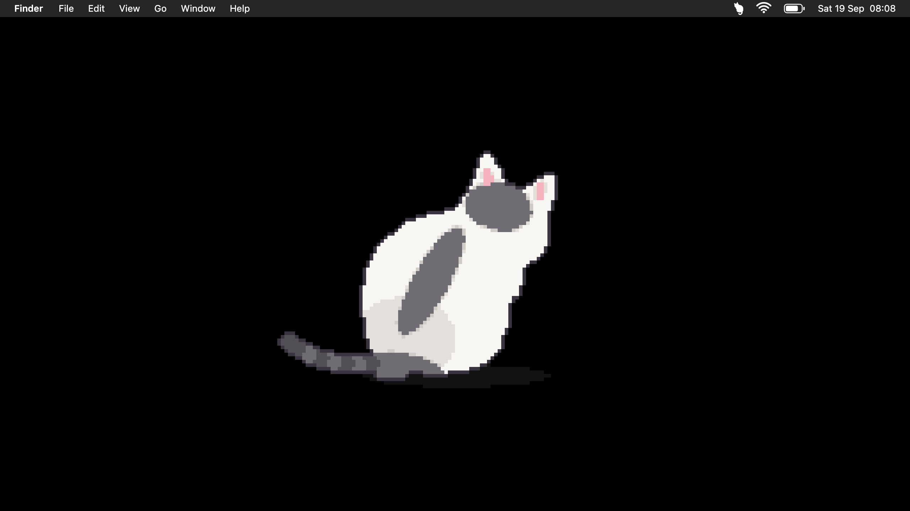

# 08

A little Mac app named after my cat. Every now and then she walks onto your screen, sits down, and reminds you to step away from the computer and enjoy life for a bit.

**Universal binary** — runs natively on both Apple Silicon and Intel Macs.

<p align="center">
  
</p>

## Download

**[Download for Mac →](https://github.com/hey-niia/08/releases/latest)**

08 is unsigned, so on first launch macOS will say it "cannot be opened because the developer cannot be verified." Right-click the app → **Open** → **Open** again, or run:

```
xattr -cr /Applications/08.app
```

## About

08 is my cat. Whenever I look at her, she reminds me that there's a whole life away from the screen — and that it's fine to slow down and go live it for a bit.

The app does the same: after you've worked for a while, she slowly walks in, sits in the middle of your screen and swishes her tail. That's your cue to get up too: stretch, look out of the window, make some tea. When the break is over, she walks away.

Right-click her icon in the menu bar to set:

- **Show every** — how long you work before she comes (5 / 15 / 25 / 50 minutes, or off)
- **Break length** — how long she sits with you (1 / 3 / 5 / 10 / 15 minutes, or until you send her away)

## Development

```
npm install
npm start          # run in dev
npm run dist:mac   # build an unsigned universal dmg + zip
```

Built with Electron + TypeScript. See `src/main` for the app shell (`catInstance.ts`/`catManager.ts` for her schedule, tray, window) and `src/renderer/popup` for the pixel-art animation.

## License

MIT.
