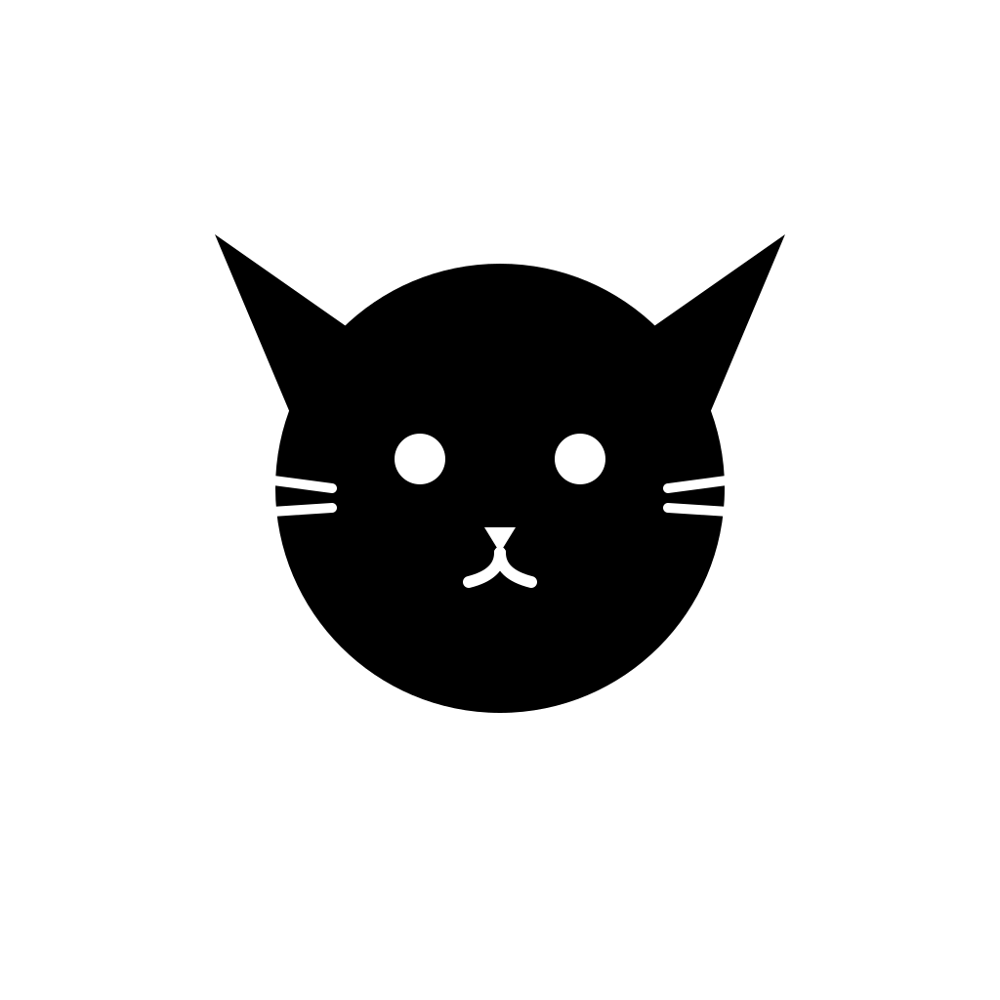

# 08

A tiny cat who lives on your Mac.

<p align="center">
  
</p>

## Download

**[Download for Mac →](https://github.com/hey-niia/08/releases/latest)**

08 is unsigned, so on first launch macOS will say it "cannot be opened because the developer cannot be verified." Right-click the app → **Open** → **Open** again, or run:

```
xattr -cr /Applications/08.app
```

## About

08 doesn't do anything, really. She lives quietly in your menu bar, and every few minutes she wanders into the corner of your screen — napping, stretching, walking, or crouching for a snack — for as long as you tell her to (right-click the tray icon to pick anywhere from one minute to "until I hide her").

That's the whole app. No chat, no clicking, no productivity feature hiding underneath. Just a small, pixelated reminder that it's fine to stop and do nothing for a moment, the way a cat does.

## The story

08 is named after my actual cat. She spends most of her day asleep in a sunbeam, and it's genuinely one of the more grounding things to watch in the middle of a stressful work session.

I wanted a tiny piece of software that borrowed that feeling — not another notification demanding attention, but the opposite: something that shows up, does nothing, and quietly suggests you could do nothing too, for a second.

She lives in your menu bar (right-click for "Show 08 now," to set how long she stays, or to quit).

**A note on the art:** the current sprites are placeholders borrowed from [wil-pe/CATAI](https://github.com/wil-pe/CATAI) (MIT-licensed — see `src/renderer/popup/sprites/ATTRIBUTION.md`) while original artwork is still in progress. `art/` has the in-repo pose generator used for the first from-scratch pass, for whenever that replacement happens.

## Development

```
npm install
npm start          # run in dev
npm run dist:mac   # build an unsigned universal dmg + zip
```

Built with Electron + TypeScript. See `src/main` for the app shell (tray, scheduler, window) and `src/renderer/popup` for the sprites and animation.

## License

MIT for the app itself. The placeholder sprites in `src/renderer/popup/sprites/` are third-party (MIT-licensed CATAI assets) — see `src/renderer/popup/sprites/ATTRIBUTION.md`.
